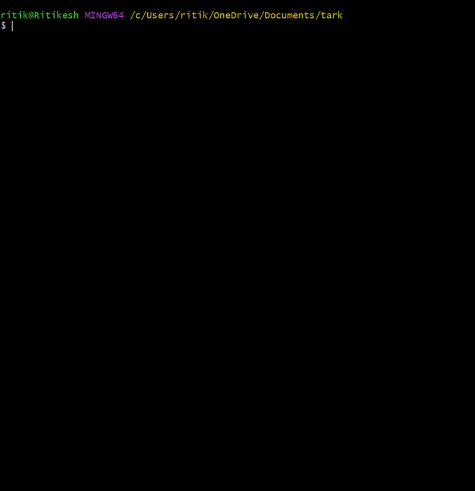
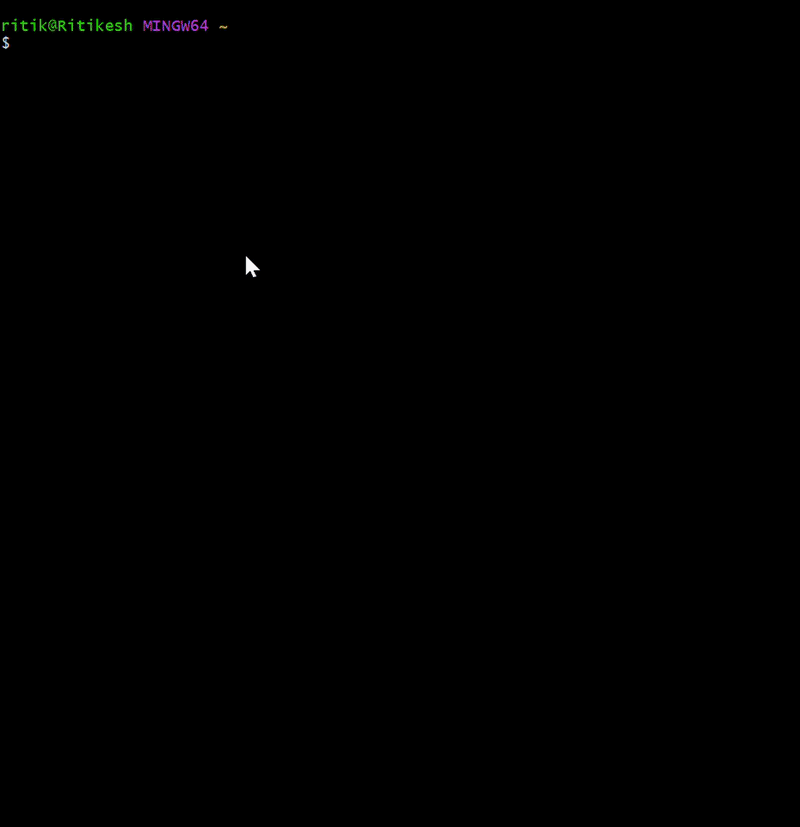

# tark

a C++ LLM inference server written from scratch.

minimal, deterministic, and built close to the metal. focused on correctness, performance, and composable primitives.

## why "tark"?
tark means logic or reasoning, deriving outputs through structured steps. this system does the same, executing inference as a sequence of explicit, controllable operations.

## how it works
HTTP thread       ->  submit request to scheduler
scheduler thread  ->  one llama_decode per iteration across all active requests
                  ->  push sampled tokens to per-request queue
HTTP thread       ->  stream tokens to client via SSE

## demo

**server startup:**



**concurrent requests, tokens interleaving:**



## current capabilities
- HTTP server with POST /v1/completions endpoint
- single-request inference via llama.cpp
- greedy decoding with GGUF model support
- token streaming (SSE)
- KV cache reuse across turns
- continuous batching
- prefix caching

## in progress
- benchmark harness vs llama.cpp server (throughput, latency, tokens/sec)

## planned capabilities
- speculative decoding
- per-request latency logging (TTFT, tokens/sec)
- /v1/metrics endpoint
- temperature + top-p sampling
- /v1/chat/completions endpoint (OpenAI chat format)
- request cancellation on client disconnect

## stack
- C++17
- llama.cpp (engine)
- cpp-httplib (HTTP)
- nlohmann/json (request/response parsing)
- chrono (time durations)

## running

**start the server**
```bash
mkdir build && cd build
cmake .. -G "MinGW Makefiles"
mingw32-make -j4
./tark /path/to/model.gguf
```

**test endpoints**
```bash
# health check
curl http://localhost:8080/health

# single response
curl -X POST http://localhost:8080/v1/completions \
  -H "Content-Type: application/json" \
  -d '{"prompt": "The meaning of life is"}'

# streaming
curl -X POST http://localhost:8080/v1/completions/stream \
  -H "Content-Type: application/json" \
  -d '{"prompt": "The meaning of life is"}' \
  --no-buffer
```

## docs
- build instructions and usage is in [SETUP.md](docs/SETUP.md)
- architectural decisions and tradeoffs are in [DESIGN.md](docs/DESIGN.md)
- implementation notes and lessons learned live in [NOTES.md](docs/NOTES.md)
- papers and blogs referenced while building found here [REFERENCES.md](docs/REFERENCES.md)